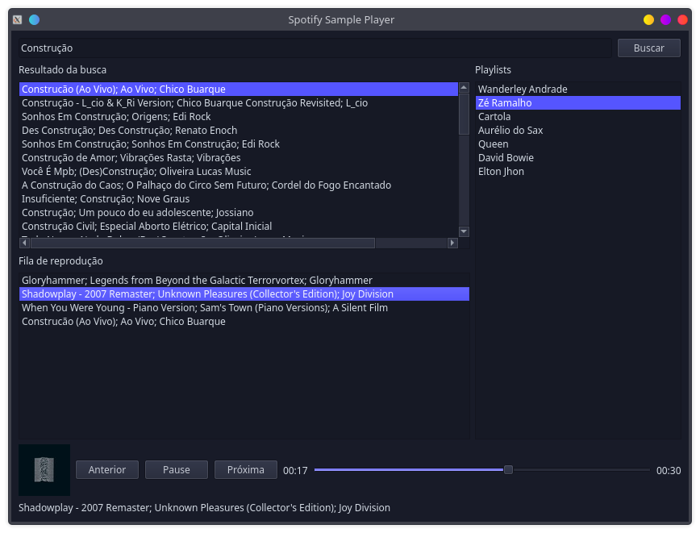

# Spotify Sample Player
Basic player and playlist manager for spotify samples, using the Spotify Web API, made in Qt.
This application opens your default browser to ask for your login on spotify, it does not access user data. 

Using this application you'll be able to search for songs on spotify on your default market (your account region), add tracks to the queue e play their 30 seconds samples and manage offline playlists with song samples.

## Dependencies:
- QtCreator with Qt 5.15.2 (openning the project and compiling)
- GStramer Plugins (for linux to reproduce samples over https)
- OpenSSL (for the connection to spotify, most linux distribution ship by default and you can install it on windows)
